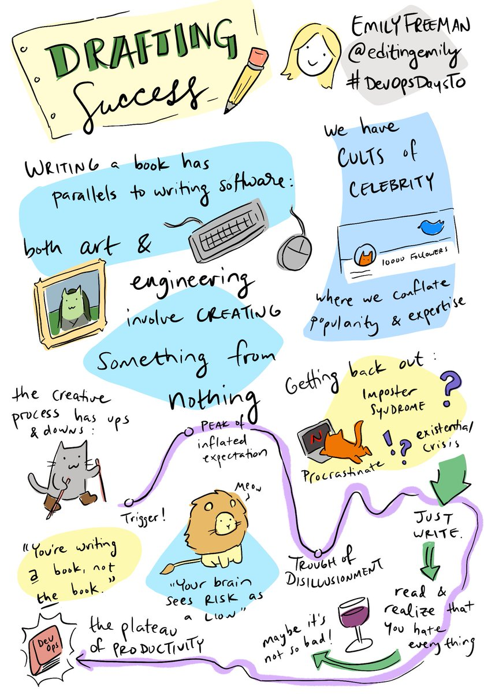
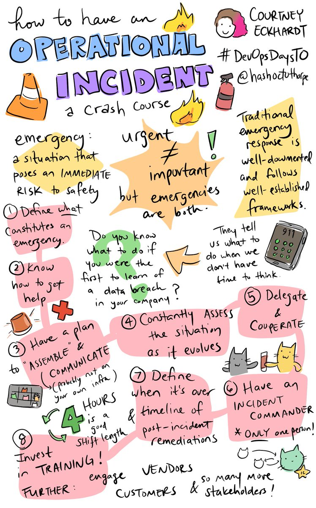
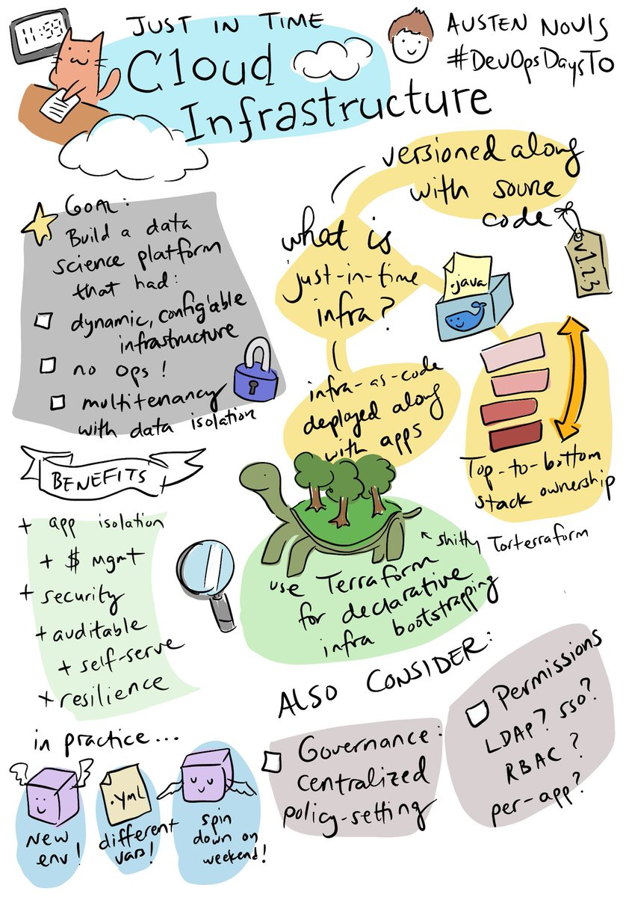
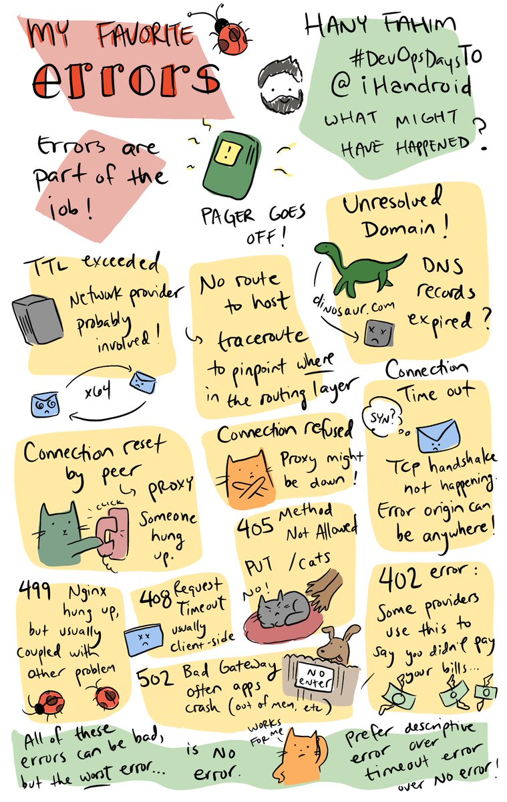
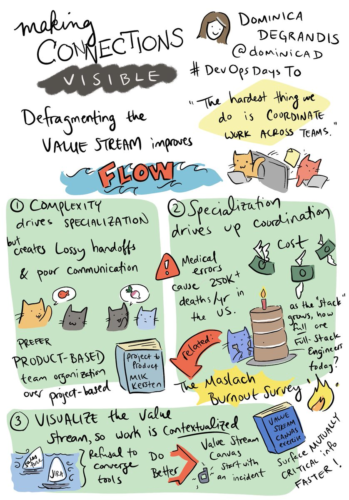
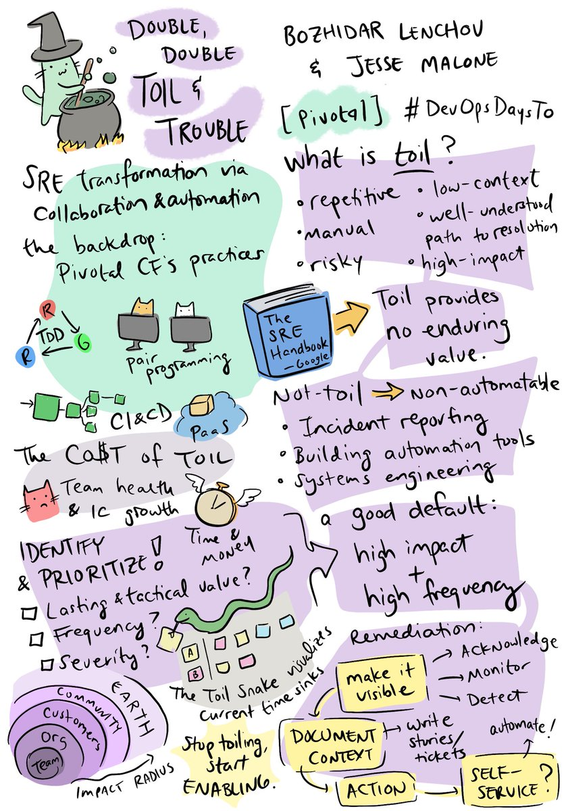

# DevOpsDays Toronto 2019

May 29-30, 2019 — Toronto, Ontario, Canada

The talks:

* [Quintessence Anx — Sensory Friendly Monitoring: Keeping the Noise Down](#anx)
* [Matthew Chum & Monti Ghai — Shortcuts and Scenic Routes: Deconstructing DevOps](#chum-ghai)
* [Dominica DeGrandis — Making Connections Visible: How To Defrag Your Value Stream](#degrandis)
* [Courtney Eckhardt — How to Have an Operational Incident (A Crash Course)](#eckhardt)
* [Hany Fahim — My Favourite Errors](#fahim)
* [Emily Freeman — Drafting Success](#freeman)
* [Jacquelyne Grindrod — Journey to the Promised Land](#grindrod)
* [Wasim Hossain — Inner Source: How TELUS is Adopting Open-Source Practices to Solve Problems of Scale, and how you can too.](#hossain)
* [Bozhidar Lenchov & Jesse Malone — Double, Double, Toil and Trouble: SRE transformation through automation and collaboration](#lenchov-malone)
* [Austen Novis — Just in Time Cloud Infrastructure: Redefining the Relationship Between Applications and Cloud Infrastructure](#novis)

Other materials:

* [event website](https://devopsdays.org/events/2019-toronto/welcome/)
* [Michael McCliment — Remote-First Work: Open spaces discussion at DevOpsDays Toronto 2019](https://medium.com/@cornazano/remote-first-work-open-spaces-discussion-at-devopsdays-toronto-2019-dfe104fb95be)
* [Michael McCliment — Value Stream Mapping References (DevOpsDays Toronto 2019)](https://medium.com/@cornazano/value-stream-mapping-references-devopsdays-toronto-2019-ffe116e7ca8a)
* [Steve Pereira — DevOps Days Toronto 2019 Day 1 (photos)](https://photos.app.goo.gl/ZenCKYS3TLxTgSH38)
* [Steve Pereira — DevOps Days Toronto 2019 Day 2 (photos)](https://photos.app.goo.gl/1B8RtnWfas2fau6z9)
* [Steve Pereira — DevOps Days Toronto 2019 Illustrations](https://photos.app.goo.gl/RaTkxqDDb4FgYHJD7)

# Day 1: Wednesday 2019-05-29

##  Drafting Success

[Emily Freeman](https://twitter.com/editingemily) (Microsoft)

> Sketchnote by [Denise Yu](http://www.deniseyu.io/art).
> Included from [here](https://twitter.com/deniseyu21/status/1133732734935949314),
> unmodified, under the terms of
> [CC BY-SA 4.0](https://creativecommons.org/licenses/by-sa/4.0/).

**Other materials**

* [Talk page on the event site](https://devopsdays.org/events/2019-toronto/program/emily-freeman/)
* [slides](https://www.dropbox.com/s/v1j3k038z19cf58/drafting%20success%20talk%20slides.pdf)
* [MindsEyeCCF sketch](https://twitter.com/MindsEyeCCF/status/1133812784838467586)
* [Twitter thread: cornazano (me)](https://twitter.com/cornazano/status/1133725021526999040)

**My livetweet contents**

> First up: @editingemily talking about the experience of writing DevOps for Dummies, and how the creative process parallels our engineering efforts. #DevOpsDaysTO

> Engineering software is a creative process. Maybe we are sculptors, coaxing machine to do what we want. #DevOpsDaysTO

> Writing a book was hard, lonely, daunting. It is a struggle. We see the highlight reels of other people, and compare it to our experience. It is a false comparison, though. #DevOpsDaysTO

> Our brain sees opportunity as risk. As a consequence, when working through a creative process, we pass through a trough of disillusionment and a great deal of self-doubt. #DevOpsDaysTO

> Following the trough, there is a _slope of enlightenment_ where things stabilize, and a _plateau of productivity_. Things get better. #DevOpsDaysTO

> The first time we do something is the hardest. It takes a plan - but at some point we need to throw it away. Tossing the plan isn't failure, but rather adaptation. #DevOpsDaysTO

> We start with the book as imagined, and at some point we need to understand what the book needs to be. This is like coding. #DevOpsDaysTO

> A plan should be a guide, not a prison. We need to grow and adapt. Growth is painful, but also part of the process. Working through it as a team can build trust. #DevOpsDaysTO

> Procrastination is usually seen as avoiding work. However, it is part of the creative process, but just doesn't feel like work. It is where we reflect and figure out how to proceed. #DevOpsDaysTO

> We need to recognize that we are not geniuses, and not simply inspired by a muse. All creators are humans just like us. We need to create environments were we support one another. We are never alone. #DevOpsDaysTO

> It is not actually tech at the heart of DevOps. It is humans. It is you. #DevOpsDaysTO

##  How to Have an Operational Incident (A Crash Course)

[Courtney Eckhardt](https://twitter.com/hashoctothorpe) (Heroku)

> Sketchnote by [Denise Yu](http://www.deniseyu.io/art).
> Included from [here](https://twitter.com/deniseyu21/status/1133752949468016643),
> unmodified, under the terms of
> [CC BY-SA 4.0](https://creativecommons.org/licenses/by-sa/4.0/).

**Other materials**

* [Talk page on the event site](https://devopsdays.org/events/2019-toronto/program/courtney-eckhardt/)
* [slides](https://drive.google.com/file/d/1wNARVP5RlGeKfXwAbPyoIbvXxz098-vM/view)
* [MindsEyeCCF sketch](https://twitter.com/MindsEyeCCF/status/1133817587761111047)
* [Twitter thread: cornazano (me)](https://twitter.com/cornazano/status/1133734628299350016)

**My livetweet contents**

> Next up: Courtney Eckhardt @hashoctothorpe talking about How to Have an Operational Incident. #DevOpsDaysTO

> Do you know what you would do if you woke up to a message telling you your AWS account was compromised? We're going to talk about emergencies. #DevOpsDaysTO

> There is a difference between urgency and importance. Urgency is about timeline; handle quickly or no longer relevant. Importance is about needs or consequences; it can be about danger. Emergencies are both _urgent_ and _important_.

> Emergencies need to be observed before we can respond. #DevOpsDaysTO

> When emergencies occur, we need to respond quickly. We don't have time to think and consider because the situation is urgent. So, we need to remove the need for responders to think; they need to already know what the next step is. #DevOpsDaysTO

> Frameworks are about organization and planning. We need an emergency response framework to help us with effective, timely response. #DevOpsDaysTO

> We need a way to know that something is going wrong; and what we consider to be an emergency in our context.

> We then need to know how to get help; single point of contact that is easier to remember. Heroku has a slackbot to do this. #DevOpsDaysTO

> Incident commander coordinates response to the emergency.
>
> Coordination requires assembling the responders, and how they will communicate. This needs to be defined and known - and have a backup plan in case the communication channel is also down. #DevOpsDaysTO

> Essence of success in coordination is delegation. Incident commander decides what to do, because it is worse to have conflict than to not taking action. The incident commander is the one paying attention to the progress of the incident. #DevOpsDaysTO

> We need to know how the incident can end, and allow the responders to disperse. How do we know when we're done? #DevOpsDaysTO

> Training needs to be offered to all engineers. Even if they won't be an incident commander, it will help them understand what to expect from the commander and why they are asking the questions they do. #DevOpsDaysTO

##  Shortcuts and Scenic Routes: Deconstructing DevOps

Matthew Chum (Genesys)
| [Monti Ghai](https://twitter.com/montighai) (Genesys)

**Other materials**

* [Talk page on the event site](https://devopsdays.org/events/2019-toronto/program/matthew-chum/)
* [slides](https://drive.google.com/file/d/16PLLtKzwtRtwP7pQGG3AxYqlbrP_D0l2/view)
* [MindsEyeCCF sketch](https://twitter.com/MindsEyeCCF/status/1133815763175915520)
* [Twitter thread: cornazano (me)](https://twitter.com/cornazano/status/1133748028710490112)

**My livetweet contents**

> Next up: Matthew Chum and Monti Ghai, Shortcuts and Scenic Routes #DevOpsDaysTO

> Gartner indicates 75% of all DevOps initiatives will fail by 2022. They will cover some pitfalls to help us not be in that stat, oriented around three catchphrases: Automate everything. You build it, you run it. One size fits all. #DevOpsDaysTO

> An early challenge: automate the deployment into a staging environment. This was needed to have repeatability and to reduce time. This was complex, and not a quick fix, because components were not designed for it. #DevOpsDaysTO

> Autonomy of teams can produce deeper silos, and can increase lead time if other people's work interacts with the deployment process. Continuous deployment is needed to mitigate these risks. #DevOpsDaysTO

> Services should be immutable and self-contained. Configuration should be minimized so that we can have a high degree of confidence that production will behave like what we've seen in staging. #DevOpsDaysTO

> Some resistance points when pursuing devops: impact on the perceived effectiveness of devs; diffs between test and prod environments; impact on developer's traditional roles; why not have a "devops" team?
>
> Among the risks: perpetuate culture that blames dev teams. #DevOpsDaysTO

> "We were told what tools to use, but not how to use them." This resulted in a lot of redundant work across teams. #DevOpsDaysTO

> When trying to move to consistent approaches, legacy components are a challenge. Rewriting them is a cost, especially when they are satisfying the current needs. At least in the short term, hybridized approaches can be used to get some benefits. #DevOpsDaysTO

> We cannot just ignore the value of our legacy systems; we also can't use it as an excuse for avoiding the use of modern practices. We need balance: festina lente (make haste slowly). #DevOpsDaysTO

##  Just in Time Cloud Infrastructure: Redefining the Relationship Between Applications and Cloud Infrastructure

Austen Novis (Capital One)

> Sketchnote by [Denise Yu](http://www.deniseyu.io/art).
> Included from [here](https://twitter.com/deniseyu21/status/1133800160398630912),
> unmodified, under the terms of
> [CC BY-SA 4.0](https://creativecommons.org/licenses/by-sa/4.0/).

**Other materials**

* [Talk page on the event site](https://devopsdays.org/events/2019-toronto/program/austen-novis/)
* [slides](https://docs.google.com/presentation/d/e/2PACX-1vSNm_LRQQSH76P2bmOnSBvk_W8cYFRvsgZ22e2GZMkWT0Fg96tBmadItXuL7bI1e7v25zv_AIQkPFyd/pub)
* [MindsEyeCCF sketch](https://twitter.com/MindsEyeCCF/status/1134200215450398720)
* [Twitter thread: cornazano (me)](https://twitter.com/cornazano/status/1133757105889062912)

**My livetweet contents**

> Next up: Austen Novis talking about Just In Time Infrastructure. #DevOpsDaysTO

> The context in which the approach evolved was building a platform, where the needs included having dynamic infrastructure, achieving as close to no ops as possible, and delivering a multitenant shareable platform. #DevOpsDaysTO

> Just in time infrastructure is an infra-as-code approach, but where the infrastructure definitions share the same lifecycle as the application; the code for the infrastructure is in the same repo as the application. Helps people see the interactions between the two. #DevOpsDaysTO

> The approach can be used with various technical stacks; it can be enabled by Capital One's particle cloud framework. #DevOpsDaysTO

> Among the benefits of JiTI: every piece of infrastructure is clearly tied to an application, making cleanup of orphan resources easier. #DevOpsDaysTO

> We can also see lower coordination costs for rollbacks, since the application and infrastructure versions are tied together. #DevOpsDaysTO

> Governance and permissions management need to be adapted to this context. They need to be more application centric rather than traditional models. #DevOpsDaysTO

> The approach also facilitates developer's ability to work, since they can more easily spin up properly configured environments to experiment with their work. #DevOpsDaysTO

##  My Favourite Errors

[Hany Fahim](https://twitter.com/iHandroid) (VM Farms)

> Sketchnote by [Denise Yu](http://www.deniseyu.io/art).
> Included from [here](https://twitter.com/deniseyu21/status/1133805355958439941),
> unmodified, under the terms of
> [CC BY-SA 4.0](https://creativecommons.org/licenses/by-sa/4.0/).

**Other materials**

* [Talk page on the event site](https://devopsdays.org/events/2019-toronto/program/hany-fahim/)
* [slides](https://speakerdeck.com/vmfarms/tales-from-the-ops-side-my-favourite-errors)
* [MindsEyeCCF sketch](https://twitter.com/MindsEyeCCF/status/1134159383661809665)
* [Twitter thread: cornazano (me)](https://twitter.com/cornazano/status/1133789014618726401)

**My livetweet contents**

> Last session before open spaces: Hany Fahim @iHandroid presenting on My Favourite Errors. #DevOpsDaysTO

> In operational work, errors are part of the job; they usually indicate where the immediate problem is. When getting paged, a useful first question is to asking what the error is. #DevOpsDaysTO

> Some useful initial tests to diagnose things that are before the application gets involved:
>
> - ping failing also tests dns and registration issues
> - no route to host tells you it is a routing issue before ever getting to the site.
>
> #DevOpsDaysTO

> More things:
>
> - Connection reset by peer errors point to a proxy as a likely culprit.
> - Connecction refused also frequently points to a proxy.
>
> Timeout is terrible as an error, though, because this could be anywhere.
>
> #DevOpsDaysTO

> [The neat thing about this talk is that illustrates how we could catalog error conditions and what the typical causes are, helping minimize the amount of thinking we need to do when managing incidents.] #DevOpsDaysTO

> We've seen an increasing number of HTTP 408 errors in recent years, due to browsers (Chrome) implementing predictors that issue tcp connections on startup; it speeds up access to your most used websites, but causes a 408 if you delay acccessing it. #DevOpsDaysTO

> An interesting case: app can return 200, nginx return 499, and the proxy return 504. To avoid this, it can help to set increasing timeouts: app timeout < nginx timeout < proxy timeout. #DevOpsDaysTO

> Least favorite error? No error, while something is obviously wrong.
>
> #DevOpsDaysTO

> Lesson from a wonderful story: getting a late page is better than no page at all, and make sure you get notified for all maintenances (even "non impacting" ones). #DevOpsDaysTO

# Day 2: Thursday 2019-05-29

##  Making Connections Visible: How To Defrag Your Value Stream

[Dominica DeGrandis](https://twitter.com/dominicad) (Tasktop)

> Sketchnote by [Denise Yu](http://www.deniseyu.io/art).
> Included from [here](https://twitter.com/deniseyu21/status/1134097412484730880),
> unmodified, under the terms of
> [CC BY-SA 4.0](https://creativecommons.org/licenses/by-sa/4.0/).

**Other materials**

* [Talk page on the event site](https://devopsdays.org/events/2019-toronto/program/dominica-degrandis/)
* [slides](https://drive.google.com/file/d/1WIYAh5diEnAJXCqS4tt6TjJeYip8HrnV/view)
* [MindsEyeCCF sketch](https://twitter.com/MindsEyeCCF/status/1134158336419672064)
* [Twitter thread: cornazano (me)](https://twitter.com/cornazano/status/1134086511945834496)

**My livetweet contents**

> Starting off day two, we have Dominica DeGrandis @dominicad talking about Making Connections Visible. #DevOpsDaysTO

> As part of the work we need to make visible, we need to see and understand the handoffs that occur at the connection points between teams / disciplines. A defragged value stream improves these handoff points and improves flow. #DevOpsDaysTO

> Three things to cover today:
>
> - Compexity drives specialization
> - Specialization increases coordination
> - How to visualize handoffs as work flows
>
> #DevOpsDaysTO

> It doesn't matter how fast dev is going - or any other part of the value stream - if that's not where the bottleneck is. [This ties into the Theory of Constraints, covered in Goldratt's _The Goal_.] #DevOpsDaysTO

> In the medical field, we've evolved from a doctor and a nurse to over 120 specialties. We see a similar range of specializations evolving in the technical space - including complexity in the information security sector. #DevOpsDaysTO

> Risks are increasing, including things like hackable medical devices. But developers are often not incentivized to work on security, and even frequently consider it to not be part of their job. #DevOpsDaysTO

> In healthcare, there is no holistic view of the patient. This contributes to medical errors being the third leading cause of death in the United States, as details get lost.
>
> And we see a parallel occurring in IT.
>
> #DevOpsDaysTO

> Our understanding of what the "stack" is in "full stack development" has been deepening; very few people are truly handling the full stack. #DevOpsDaysTO

> Trying to truly do full stack is a driver for cognitive overload, which will contribute to burnout (see Maslach's work for more insight on this). #DevOpsDaysTO

> [Link to Maslach's DOES 18 presentation: https://www.youtube.com/watch?v=gRPBkCW0R5E …] #DevOpsDaysTO

> People often don't know where there work originates from. It just shows up in Jira. A value stream canvas exercise targeting a specific type of work (e.g., incident management) can help us understand how work actually occurs. #DevOpsDaysTO

> Value stream canvas exercises can help us to determine where the bottlenecks are in our value stream. #DevOpsDaysTO

##  Inner Source: How TELUS is Adopting Open-Source Practices to Solve Problems of Scale, and how you can too.

[Wasim Hossain](https://twitter.com/wascloud) (TELUS)

**Other materials**

* [Talk page on the event site](https://devopsdays.org/events/2019-toronto/program/wasim-hossain/)
* [slides](https://drive.google.com/file/d/1LqcTOtFQy53hrovLBDGbsmlNlyWShNFd/view?usp=drivesdk)
* [MindsEyeCCF sketch](https://twitter.com/MindsEyeCCF/status/1134152791755300864)
* [Twitter thread: cornazano (me)](https://twitter.com/cornazano/status/1134097009735086080)

**My livetweet contents**

> Next up is Wasim Hossain @wascloud talking about inner source at Telus. #DevOpsDaysTO

> Telus' digital team consisted of 60 developers in 2014; they were able to fit everyone in a single large room to make technical decisions. By 2016, grew to 200 team members and the existing processes didn't work anymore. 435 people now. #DevOpsDaysTO

> A problem that shows up: consumer-facing online presence had variation in how things were presented. This was a consequence of different teams using different tools to build these experiences. #DevOpsDaysTO

> Looking at open source projects, we see things like kubernetes with 2000+ contributors. It makes coordinating 60 people seem easy. What can we learn? #DevOpsDaysTO

> Some key properties:
>
> * Open collaboration
> * Modular and testable architecture
> * Strong core team
>
> #DevOpsDaysTO

> Inner source applies open source approaches to software development and applies them to how organizations develop their code bases. A first step at Telus was to work on reference standards and practices. #DevOpsDaysTO

> Shifting to an inner source model has influenced how they work. The team used to have to reach out to other teams and request they update to newer versions of their libraries; the onus is now on the teams that consume the code. #DevOpsDaysTO

> If considering adopting an inner source model, it is important to ask some questions to see if there is a cultural fit. Without this, the initiative may not succeed. #DevOpsDaysTO

> To move to an inner source model, recommends starting by:
>
> * Introducing a culture of transparency;
> * Estabilshing testing and coding standards; and
> * Architecting for collaboration.
>
> #DevOpsDaysTO

##  Double, Double, Toil and Trouble: SRE transformation through automation and collaboration

Bozhidar Lenchov (Pivotal)
| Jesse Malone (Pivotal)

> Sketchnote by [Denise Yu](http://www.deniseyu.io/art).
> Included from [here](https://twitter.com/deniseyu21/status/1134120079166251009),
> unmodified, under the terms of
> [CC BY-SA 4.0](https://creativecommons.org/licenses/by-sa/4.0/).

**Other materials**

* [Talk page on the event site](https://devopsdays.org/events/2019-toronto/program/bozhidar-lenchov/)
* [slides](https://drive.google.com/file/d/1xzTJraB831bO-KE8Wm1mIPPD2XVwILym/view?usp=drivesdk)
* [MindsEyeCCF sketch](https://twitter.com/MindsEyeCCF/status/1134155991803711489)
* [Twitter thread: cornazano (me)](https://twitter.com/cornazano/status/1134111665258160128)

**My livetweet contents**

> Next up: Bozhidar Lenchov and Jesse Malone talking about toil and SRE transformation. #DevOpsDaysTO

> What is toil? Some common elements: well defined path to resolution; little decision making (automatable); repetitive; reactive; prone to error; no new value provided. #DevOpsDaysTO

> To help qualify this, we should also answer the qestion... What is _not_ toil? Overhead, work with long term value, incident reporting, automation, systems engineering. #DevOpsDaysTO

> All toil has costs for the team and the organization. It affects flow and team health, and costs us both time and money. #DevOpsDaysTO

> Paying attenton to our daily work can help us identify toil. Listening to new team members can be particularly valuable here. Tracking recurrence - including time spent - can feed into prioritizing what toil to address. #DevOpsDaysTO

> Among things to consider: what other teams / stakeholders are impacted? Combination of costs and scope determines the overall impact of a particular element of toil. #DevOpsDaysTO

> We can't necessarily resolve a source of toil by making a single change. We can [and should!] iterate on our mitigations / solutions. #DevOpsDaysTO

> SLIs and SLOs are important for Site Reliability Engineering. SLIs represent customer experience, SLOs represent customer expectations. #DevOpsDaysTO

> The practices, techniques, and tools can be propagated through cultural change. This is how the results can be scaled to a larger organization. #DevOpsDaysTO

> Cultural change comes from the bottom up. It does not work through command and control dictates. "Culture eats strategy for breakfast." (Drucker) #DevOpsDaysTO

##  Sensory Friendly Monitoring: Keeping the Noise Down

[Quintessence Anx](https://twitter.com/QuintessenceAnx) (Logz.io)

**Other materials**

* [Talk page on the event site](https://devopsdays.org/events/2019-toronto/program/quintessence-anx/)
* [slides](https://noti.st/quintessence/Muw5Fk/sensory-friendly-monitoring-keeping-the-noise-down)
* [MindsEyeCCF sketch](https://twitter.com/MindsEyeCCF/status/1134150266612256768)
* [Twitter thread: cornazano (me)](https://twitter.com/cornazano/status/1134120891548360706)

**My livetweet contents**

> Next up: Quintessence Anx @QuintessenceAnx helping us learn to keep the noise down, talking to us about Sensory Friendly Monitoring. #DevOpsDaysTO

> When we try to know everything, we get overloaded and we end up muting things and burying whole sources of information. This makes it artificially quiet, but we can't trust it. #DevOpsDaysTO

> Quick interactions that interrupt us cost us time when trying to meet goals. A study has indicated it can take 25 minutes to recover from something as simple as "what's the wifi password?" #DevOpsDaysTO

> Most brains are not wired for multitasking. Study: Error rates on straightforward tasks *tripled* when trying to multitask. #DevOpsDaysTO

> Our goal needs to be aware without becoming overwhelmed. A starting point to get control of the noise and disruption in our work context is to understand the information flows; setting and communicating boundaries can help us protect our own work space. #DevOpsDaysTO

> Developing that understanding starts by categorizing the noise, which helps us make sure that each source is properly configured and tuned to what we need to know. #DevOpsDaysTO

> Two important points: redundancy and housekeeping are needed. We don't want to lose visibility if a single source fails. We also don't want irrelevant alerts, they just encourage us to ignore our sources of information. #DevOpsDaysTO

##  Journey to the Promised Land

[Jacquelyne Grindrod](https://twitter.com/devopsjacquie) (Medstack)

**Other materials**

* [Talk page on the event site](https://devopsdays.org/events/2019-toronto/program/jacquelyne-grindrod/)
* [slides](https://noti.st/devopsjacquie/uScDZq)
* [Twitter thread: cornazano (me)](https://twitter.com/cornazano/status/1134150533399371776)

**My livetweet contents**

> The last session of the main track: Jacquelyne Grindrod talking to us about the Journey to the Promised land. #DevOpsDaysTO

> On average, it costs $5,600 per minute of downtime. 99.9% availability allows only 42 minutes of downtime per month. #DevOpsDaysTO

> The promised land is built from the ground up; our ideal state will differ depending on our context. #DevOpsDaysTO

> As a team, they had worked through from firefighting to something that once seemed out of reach. But without the details of how they got there, they can't share with others how to get there and replicate the results. #DevOpsDaysTO

> Understanding where we've been and how we got here needs retrospection. We need to start with the questions of where we are you going, and why? #DevOpsDaysTO

> The foundation for success is the _culture_. Processes and technologies to succeed are layered on top of this. #DevOpsDaysTO

> When they built a pipeline, they made opinionated decisions... but there wasn't enough coordination. Discussion and coordination could have avoided gaps between needs and the outcomes they got. #DevOpsDaysTO

> A lesson in process: trying to measure and manage interrupts by timers or help forms created barriers. A regular meeting worked better. #DevOpsDaysTO

> Building stable products starts before any code is commited. Work through culture and process before getting to the tech stuff. #DevOpsDaysTO

> Question: How should we start?
> Answer: Watch for what hurts. Start working on it. And even if you don't succeed, you've still learned something and can help guide you forward.
>
> #DevOpsDaysTO
