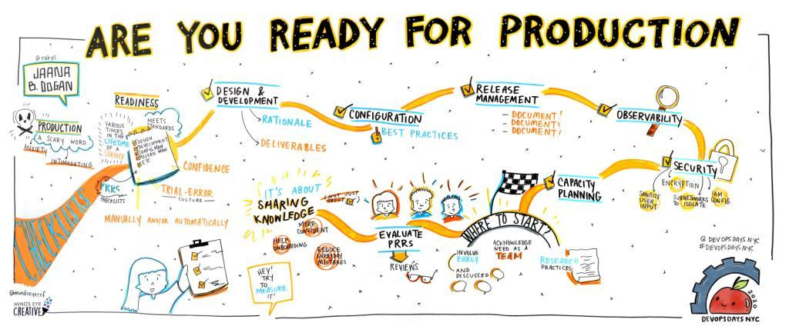
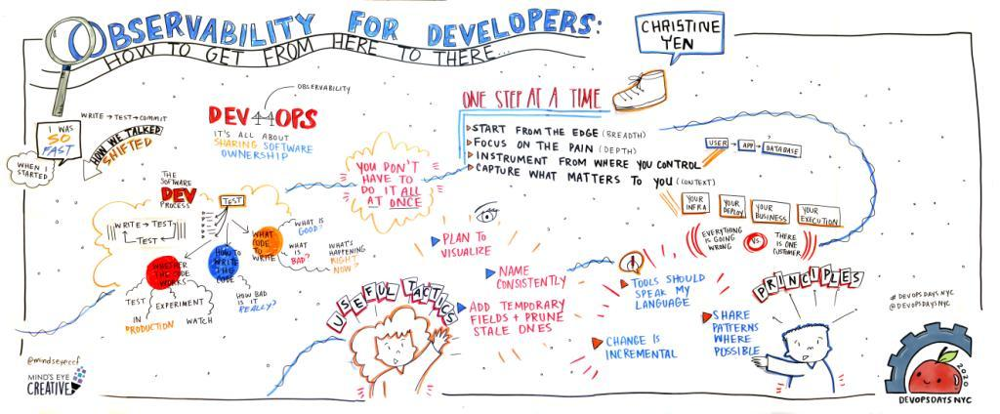
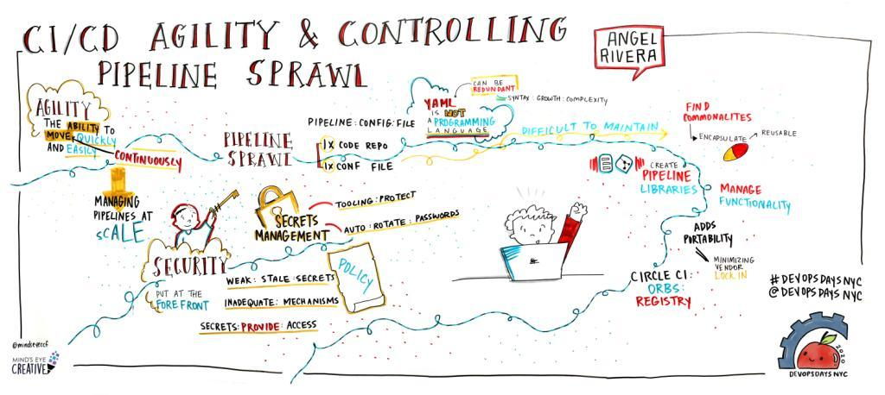
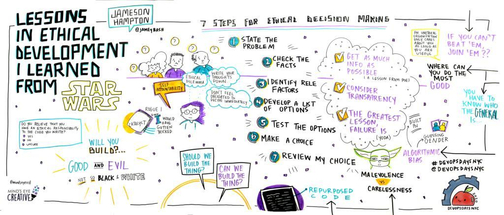
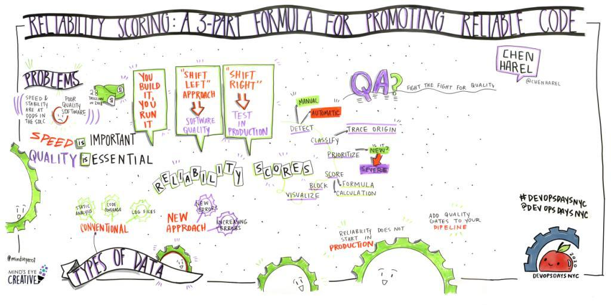
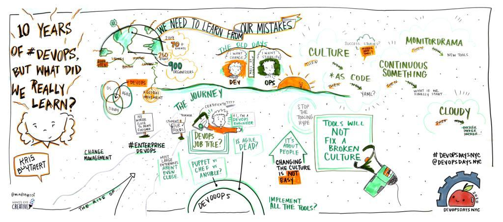
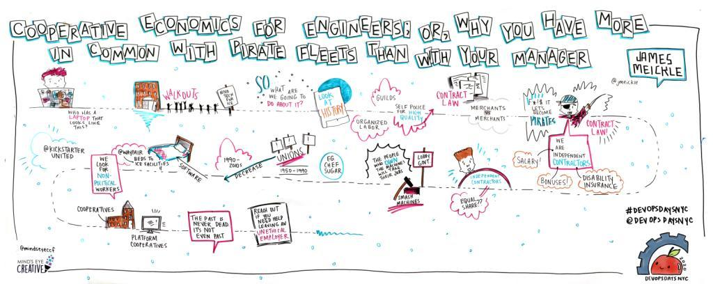
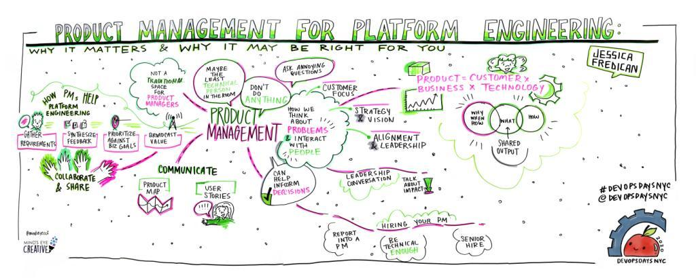
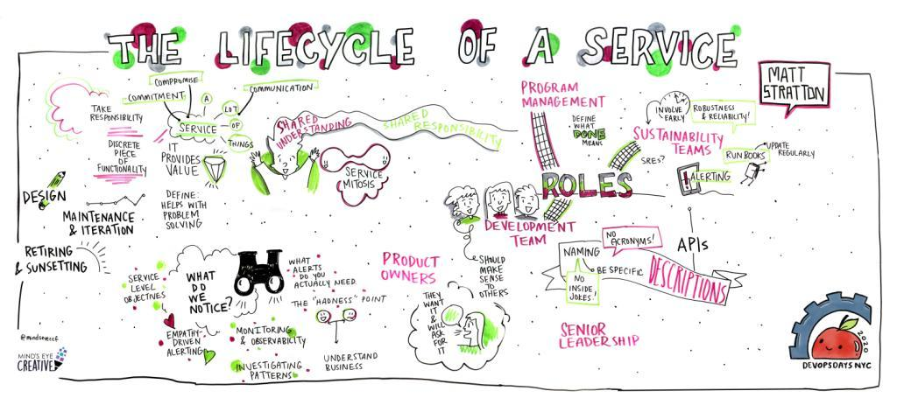
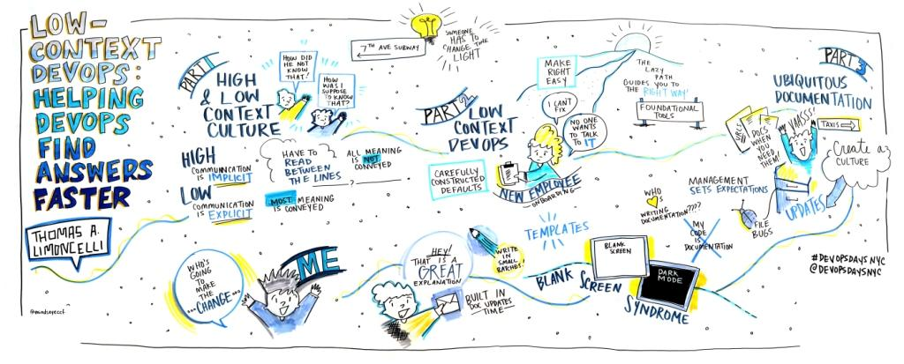

# DevOpsDays New York City 2020

March 3-4, 2020 — New York, New York, United States

The talks:

* [Kris Buytaert — 10 Years Of #devops, But What Did We Really Learn?](#buytaert)
* [Jaana B. Dogan — Are You Ready For Production?](#dogan)
* [Jessica Fredican — Product Management For Platform Engineering: Why It Matters And Why It May Be Right For You](#fredican)
* [Jameson Hampton — Lessons In Ethical Development I Learned From Star Wars](#hampton)
* [Chen Harel — Reliability Scoring: A 3-Part Formula For Promoting Reliable Code](#harel)
* [Thomas A. Limoncelli — Low-Context DevOps: Helping DevOps Find Answers Faster](#limoncelli)
* [James Meickle — Cooperative Economics For Engineers; Or, Why You Have More In Common With Pirate Fleets Than With Your Manager](#meickle)
* [Angel Rivera — CI/CD Agility And Controlling Pipeline Sprawl](#rivera)
* [Matt Stratton — The Lifecycle Of A Service](#stratton)
* [Christine Yen — Observability For Developers: How To Get From Here To There](#yen)

Other materials:

* [event website](https://devopsdays.org/events/2020-new-york-city/welcome/)

# Day 1: Wednesday 2020-03-03

##  Are You Ready For Production?

[Jaana B. Dogan](https://twitter.com/rakyll)

> Visual recording by [MindsEyeCCF](http://www.mindseyecreative.ca/).

**Twitter thrads:**

[cornazano (me)](https://twitter.com/cornazano/status/1234846440586911747)
| [IAmJerdog (Jeremy)](https://twitter.com/IAmJerdog/status/1234848091859292160)
| [lizthegrey (Liz Fong-Jones)](https://twitter.com/lizthegrey/status/1234845998884757506)

**My livetweet contents**

> First speaker of the day will be @rakyll, asking us "Are you ready for production?" #devopsdaysnyc

> Production is an environment that produces anxiety, especially if you have the wrong tools and wrong practices. You'll feel judged if you fail. #devopsdaysnyc

> Some key questions: how do we know if we're ready to push to production? What's good or bad? how do we transfer knowledge? #devopsdaysnyc

> Production readiness reviews should be done at various times in a service's lifetime. For example, when getting ready for a launch or for oncall handoffs. These reviews can help propagate useful practices and help with building confidence. #devopsdaysnyc

> Production guidelines provide things you could / should consider in getting ready to ship new code to production. Review efforts can be manual, or partially automated. #devopsdaysnyc

> There should be more than just checklist items - what is the rationale for each item? History associated with it? #devopsdaysnyc

> PRR can include pointers in topic areas for people who have no experience with them: tracing, obervability, security elements are examples. #devopsdaysnyc

> Some of the production readiness considerations are actually design-time concerns. These need to be addressed early, and may need subject-specific expertise (example: security). #devopsdaysnyc

> Checklists for PRR should provide insights about design tradeoffs; developers should be able to use these as resources early in the lifecycle of preparing a new service.
>
> They also help with onboarding!
>
> #devopsdaysnyc

> "No review means repeated mistakes and failures, as well as burnout." #devopsdaysnyc

> PRR is not about checking boxes; it is about sharing knowledge. Keep the process as lightweight as possible, and should be evaluated to ensure it is providing value. [fin] #devopsdaysnyc

##  Observability For Developers: How To Get From Here To There

[Christine Yen](https://twitter.com/cyen)

> Visual recording by [MindsEyeCCF](http://www.mindseyecreative.ca/).

**Twitter thrads:**

[cornazano (me)](https://twitter.com/cornazano/status/1234851998207553542)
| [lizthegrey (Liz Fong-Jones)](https://twitter.com/lizthegrey/status/1234851595227160576)

**My livetweet contents**

> Second talk is @cyen, presenting about "observability for developers" #devopsdaysnyc

> As a dev, write/test/commit cycles are fast. She went through a few jobs before actually working wtih an ops person, and then learned that it's longer - including release/break/fix steps of the overall pipeline. This build a bridge between the dev and ops sides. #devopsdaysnyc

> Software ownership needs to be shared, and that starts with observability - the ability to ask questions about our systems. #devopsdaysnyc

> As developers get more familar with how software behaves in production, it allows them to write better code in the first place. Observing production extends the necessary feedback loops. #devopsdaysnyc

> Story: People were terrified of touching the code, because they didn't understand what it did. Needed to understand what was good and bad _from a user perspective_. Quantified pain based on what is happening in production, _not opinion_. #devopsdaysnyc

> We also need to understand how bad things really are when there is a problem, and whether the code actually works. We can't enumerate everything; we need to be able to check in production. #devopsdaysnyc

> This is about testing hypotheses and gaining confidence. But this is hard. Happily, _you don't need to do everything at once_. Small improvements in instrumentation and observability are a path to getting better. #devopsdaysnyc

> Getting devs more familiar with prod:
>
> * start from the edge (client focused)
> * focus on the pain (depth)
> * instrument from where you can control
> * capture what matters to you (this is contextual)
>
> #devopsdaysnyc

> There are multiple layers of context: infrastructure (which machines), deployment (which version of your code), business (what do you need eg shopping cart), execution (individual payload, customer). #devopsdaysnyc

> Production tools should speak my language - if they don't relate to things in the domain we manage, they won't be usable. [Note: this is a question of writing our automation in ways that are adapted to human cognitive capabilites.] #devopsdaysnyc

> You as a developer can make your life easier in the future. We can help ourselves make better choices - for example, instead of making yourself join and correlate log lines, consider emitting messages with the full context. [fin] #devopsdaysnyc

##  CI/CD Agility And Controlling Pipeline Sprawl

[Angel Rivera](https://twitter.com/punkdata)

> Visual recording by [MindsEyeCCF](http://www.mindseyecreative.ca/).

**Twitter thrads:**

[cornazano (me)](https://twitter.com/cornazano/status/1234938049991065602)
| [lizthegrey (Liz Fong-Jones)](https://twitter.com/lizthegrey/status/1234938689878360065)

**My livetweet contents**

> Next talk will be @punkdata talking about "CI/CD agility and controlling pipeline sprawl". #devopsdaysnyc

> Agility is the ability to move quickly and easily. For CI/CD agility, we want to do this _continuously_. #devopsdaysnyc

> How do we manage pipelines at scale? We'll talk about two aspects: security and pipeline sprawl. #devopsdaysnyc

> Secrets are often not well protected in our pipelines. They may be weak, stale, potentially stored in clear text in environment variables. These are vectors for exposure. #devopsdaysnyc

> Tooling can help automate secrets management and policies; Vault is a popular choice for management. The tooling can also support random generation, auto rotation (pipelines can get fresh credentials every hour, for example). #devopsdaysnyc

> For many organizations, there is a configuration file integrated into each repo that defines the pipeline associated with that code. This means we get a 1:1 ratio between repos and pipeline definitions. #devopsdaysnyc

> YAML can be highly redundant. As pipelines grow, the complexity of the yaml files grows as well. We now need to propagate to all repos whenever we need to make a change. This gets heavy when we have 100+ repos. #devopsdaysnyc

> Uploading to an S3 bucket with hardcoded values of the bucket names. Recommendation: don't hardcode the yaml, and instead create pipeline libraries. Python, Go, Bash, PowerShell scripts are common options. #devopsdaysnyc

> This reduces the number of places to change when an update is needed, and improves portability and vendor lock-in. #devopsdaysnyc

##  Lessons In Ethical Development I Learned From Star Wars

[Jameson Hampton](https://twitter.com/jameybash)
| [lizthegrey (Liz Fong-Jones)](https://twitter.com/lizthegrey/status/1234945398277537792)

> Visual recording by [MindsEyeCCF](http://www.mindseyecreative.ca/).

**Twitter thrads:**

[cornazano (me)](https://twitter.com/cornazano/status/1234945339586732032)

**My livetweet contents**

> Next up: @jameybash talking about "Lessons About Ethical Development I learned from Star Wars." #DevOpsDaysNYC

> Life isn't as simple as the good/bad dichotomy presented in Star Wars. Good people do bad things - because they don't realize what they're doing, because they're tricked, or tempted. Anakin was a war hero in the Clone Wars, and (spoiler!) became Darth Vader. #DevOpsDaysNYC

> Chief architect of the death star was a pacifist who was manipulated, didn't know what he was working on. "I would have gotten tricked!" - You don't always know when you're treading in dangerous waters. #DevOpsDaysNYC

> It's important to think about ethical lines ahead of time - starting to think at the moment you're faced with an ethical dilemma isn't the best time to do this. #DevOpsDaysNYC

> Seven step process for ethical decisions:
>
> 1. state the problem
> 2. Check the facts
> 3. Identify relevant factors
> 4. Develop a list of options
> 5. Test the options (harm, publicity, defensibility...)
> 6. Make a choice
> 7. Review your choice
>
> #DevOpsDaysNYC

> You can believe you're doing the right thing, and still mess it up. You may be missing information. If you're in a position of power, consider transparency. Failure is the greatest teacher. #DevOpsDaysNYC

> "The time to realize the thing you built is horrible is not after you've already made it." #DevOpsDaysNYC

> You can't control how people use your work once it's out in the world; your code can be repurposed. For example, facial recognition software developed for video games may be used for identifying protestors. #DevOpsDaysNYC

> We can't actually separate politics from our work. We can only accept it or live in denial. #DevOpsDaysNYC

> This comes into play when we build things with built-in algorithmic biases. Example: COMPAS, which is only ~60% accurate at best on predicting recidivism, but is used in determining sentencing. #DevOpsDaysNYC

> Consider the question of where you can do the most good. Possibly quit and put efforts elsewhere? Staying and arguing against the issues? Whistleblowing? #DevOpsDaysNYC

> "An unethical organization only cares about you as long as you're useful to it."
>
> The rebellion in Star Wars contains people who care about you; The Empire discards and replaces people. #DevOpsDaysNYC

> We all need to decide where our personal line is. We should make this decision consciously. [fin] #DevOpsDaysNYC

##  Reliability Scoring: A 3-Part Formula For Promoting Reliable Code

[Chen Harel](https://twitter.com/chenharel)

> Visual recording by [MindsEyeCCF](http://www.mindseyecreative.ca/).

**Twitter thrads:**

[cornazano (me)](https://twitter.com/cornazano/status/1234953918158901248)

**My livetweet contents**

> Last talk of the day is Chen Harel, talking about "Reliability Scoring: A 3-part formula for promoting reliable code" #DevOpsDaysNYC

> [Missed the twitter handle in the first post - @chenharel] #DevOpsDaysNYC

> Team was working and reactive to customer impacting issues; they realized they could do more earlier.
>
> They realized they needed to address it, and that it is an industry wide issue; poor quality software cost $2.8 *trillion* in 2018. #DevOpsDaysNYC

> We address it today through "you build it you run it" and shifting left. The team wanted to measure their quality, to grade the reliability of their software. #DevOpsDaysNYC

> A first quality gate includes some conventional data points: static analysis (linters, SonarQube), code coverage, log files. #DevOpsDaysNYC

> Additional data points: new errors, increasing error rates / volumes, slowdowns (increased latency). They wanted to look at this as early as possible in their pre-prod environments. #DevOpsDaysNYC

> The scoring process they developed goes through specific steps:
>
> * detecting all errors and slowdowns;
> * classifying them;
> * prioritizing by severity;
> * scoring the build;
> * blocking builds; and
> * visualizing the data.
>
> #DevOpsDaysNYC

> A key point is to make sure that the tools you have for monitoring in prod environments are also available in pre-prod environments. #DevOpsDaysNYC

> Set up a relatively naive scoring system: if you start with 100, and identify 3 null pointer exceptions, deduct 3 points. From there, they played with the math to decide when a build should be failed in the pipeline. #DevOpsDaysNYC

> Reliability does not start in production; need to add quality gates into your pipeline. [fin] #DevOpsDaysNYC

# Day 2: Thursday 2020-03-04

##  10 Years Of #devops, But What Did We Really Learn?

[Kris Buytaert](https://twitter.com/KrisBuytaert)

> Visual recording by [MindsEyeCCF](http://www.mindseyecreative.ca/).

**Twitter thrads:**

[cornazano (me)](https://twitter.com/cornazano/status/1235205754078081024)

**My livetweet contents**

> First talk of the day is @KrisBuytaert sharing "10 years of #devops, but what did we really learn?" #DevOpsDaysNYC

> DevOps started back in 2009, at the intersection of of open source, agile, and cloudy approaches to software. #DevOpsDaysNYC

> We study history becasue it repeats, and because we need to learn from our mistakes. The "old days" involved the well-known gap between the people who built software, and the people who needed to make it actually work. It is still day-to-day for many orgs. #DevOpsDaysNYC

> DevOpsDays themselves have changed. He's able to mostly predict what will show up in open spaces. #DevOpsDaysNYC

> Today, we're trying to get people to understand that SAFe isn't really agile. We're not hearing a lot of success stories.
>
> We moved from infra as code discussions to writing yaml (which is not code).
>
> #DevOpsDaysNYC

> Don't lie to yourself that having branches you never merge is doing CI. You're doing continuous disintegration. We need to talk about _actually_ doing trunk based development. #DevOpsDaysNYC

> We have a newfound love for monitoring, with major changes in the techologies used. Opentracing and observability are in the discussion - but maybe not everybody needs to go there yet? #DevOpsDaysNYC

> Docker is currently very popular. But.... we just had a docker release that crashed on hello world. This is not the stability he went to the open source world for. #DevOpsDaysNYC

> Tools are not the thing that will fix our industry. "Are you really doing DevOps if you're not doing Kubernetes?" [Yes.] #DevOpsDaysNYC

> We often have kind of standups and a bit of agility; not actual agility, not actually having teams that can decide what they should be building. #DevOpsDaysNYC

> We spent a bunch of time discussing what tools to use for your devops stack. What we _should_ have been doing was simply getting people to _use a tool_. The key problem with ITIL is that we do it by hand instead of automating. #DevOpsDaysNYC

> Most large enterprises are not even close to agile or devops, and keep lying to themselves that they are pretty much there, and driving people to burnout. #DevOpsDaysNYC

> What have we learned? Not much - we've moved in circles. Success stories are often local successes, not full organization successes. #DevOpsDaysNYC

> What we need to be today are teachers, evangelists, change agents. It isn't about the tools, it's about the people and the culture. [fin] #DevOpsDaysNYC

##  Cooperative Economics For Engineers; Or, Why You Have More In Common With Pirate Fleets Than With Your Manager

[James Meickle](https://twitter.com/jmeickle)

> Visual recording by [MindsEyeCCF](http://www.mindseyecreative.ca/).

**Twitter thrads:**

[cornazano (me)](https://twitter.com/cornazano/status/1235213286586699785)

**My livetweet contents**

> Next up is @jmeickle, who will be talking with us about "Cooperative Economics for Engineers". #DevOpsDaysNYC

> Subtitle: "Why you have more in common with pirate fleets than with your manager". #DevOpsDaysNYC

> Hardhats at construction sites, much like our laptops, have a lot of stickers on them... but with a difference. At construction sites, many of those stickers are from unions. #DevOpsDaysNYC

> We've recently seen an evolution in the tech space with union organizing and union busting activities, and organization surrounding social responsibility. #DevOpsDaysNYC

> If we look back at history, labor organization starts back in the middle ages with guilds being formed. A guild is, in modern terms, a union shop. They're not only providing training, but also benefits and ensuring minimum compensation. #DevOpsDaysNYC

> People in the guild self-policed for quality, reviewing one another's work.
>
> In parallel, merchants developed contract law, and merchants would review claimed violations.
>
> This allowed worker owned and operated businesses in a middle class.
>
> #DevOpsDaysNYC

> Colonialism broke this, and merchants with ships shifted to piracy - and had articles of contracts between ships, based on earlier merchant shipping agreements.
>
> The pirates themselves were essentially independent contractors.
>
> #DevOpsDaysNYC

> The compensation differential betwen individuals and captains was on the order of 2:1 - not 200:1 or above. #DevOpsDaysNYC

> Today, disruption in the open source community (Chef Sugar, for example) isn't harshly punished. Looking at it from a historical perspective, in a decade, we may see a shift to disproportionate punishment for disrupting cloud systems. #DevOpsDaysNYC

> One of the reasons tech companies were successful at the outset is that they prevented people from unionizing from the start. It's pretty good for the people that own the companies, and pretty bad for everyone else. #DevOpsDaysNYC

> This may be changing. Kickstarter has unionized - despite the engagement of anti-union lawyers.
>
> Another model is cooperatives, where there is no distinction between owners and workers.
>
> #DevOpsDaysNYC

> Unions and coops may be an alternative to today's venture capital approach, with a longer-term sustainable perspective replacing the short-term value extraction model. #DevOpsDaysNYC

> "We live in capitalism. Its power seems inescapable. So did the divine right of kings." -- Ursula K. Le Guin. [fin] #DevOpsDaysNYC

##  Product Management For Platform Engineering: Why It Matters And Why It May Be Right For You

[Jessica Fredican](https://twitter.com/JessicaFredican)

> Visual recording by [MindsEyeCCF](http://www.mindseyecreative.ca/).

**Twitter thrads:**

[cornazano (me)](https://twitter.com/cornazano/status/1235300162689433608)

**My livetweet contents**

> The next speaker is @JessicaFredican, who will talk with us about "Product Management for Platform Engineering: Why it matters and why it might be right for you." #DevOpsDaysNYC

> Product managers haven't traditionally been engaged with platform engineering teams.
>
> What do product managers do? Nothing... but they take a user centered and problem centered approach to set a strategic vision for the product. #DevOpsDaysNYC

> Different disciplines may have differing perspectives on where we need to improve; product managers sit in the middle of this and look more broadly at the user needs. #DevOpsDaysNYC

> What is a product? It is a mix of considerations across customer challenges, business goals, and technology. #DevOpsDaysNYC

> What actually gets built emerges from the intersection of the work by product and engineering teams. Ideally, your product manager is sharing enough information about consumer context for engineering teams to solve for that need. #DevOpsDaysNYC

> Product management skills can help validate user needs before we ever build code, help get feedback, and prioritize work against business goals. They can also help broadcast and share the value delivered by the engineering teams. #DevOpsDaysNYC

> What can we as engineers expect? Less technical than we are, but help setting direction via product strategy roadmaps and, at a finer-grained level, help with creating user stories - especially with a focus on _why_ we want to build the thing. #DevOpsDaysNYC

> Done well, this is a *conversation*. Product managers will ask lots of questions - this is both about learning, and about helping make sure the things we build will be useful. #DevOpsDaysNYC

> Product owns the why and the strategy, and so they also need to own prioritization; they need all the context in order to make good prioritization tradeoffs. #DevOpsDaysNYC

> Even for small teams, getting a product manager involved can help inform decisions about _when_ to make technical investments. From both the product and engineering sides, it is really important to have discussions rather than having tech debt blow things up. #DevOpsDaysNYC

> For a product engineering team, you have a lot of customers - literally all of the other engineering teams! #DevOpsDaysNYC

##  The Lifecycle Of A Service

[Matt Stratton](https://twitter.com/mattstratton)

> Visual recording by [MindsEyeCCF](http://www.mindseyecreative.ca/).

**Twitter thrads:**

[cornazano (me)](https://twitter.com/cornazano/status/1235309578973257736)

**My livetweet contents**

> The next speaker today is @mattstratton, covering "The Lifecycle of a Service." #DevOpsDaysNYC

> Imagine a world where everything is clear about what you're working on, what you depend on, what people care about and what their needs are. How can we get there? #DevOpsDaysNYC

> We talk about service ownership, which is about taking responsibility for the quality of what you ship.
>
> A service is a distinct thing that is wholly owned by a team - a boundary of responsibility - and we need a shared understanding of what it is. #DevOpsDaysNYC

> If two services need to be fixed in concert with one another, they remain one service - they're inside of the same responsibility boundary. #DevOpsDaysNYC

> Service ownership is a *shared responsibility*. There are multiple roles. #DevOpsDaysNYC

> You want a standard process that your org has agreed upon for development; code needs to make sense to other people who will interact with it. This takes being *deliberate* about our choices. #DevOpsDaysNYC

> Name services based on what they do, not on inside jokes or acronyms of overly-long names. We need to be able to onboard people, and cope with future "us". Descriptions are alos useful. #DevOpsDaysNYC

> A sustainability team is also a needed role (may be an SRE team, or some other group of people).
>
> Runbooks can be helpful, but if you can't keep it up to date you should abandon it.
>
> Alerts must be actionable (normalization off deviance is a risk otherwise).
>
> #DevOpsDaysNYC

> Program management and product ownership are both part of the ownership roles as well. What is "done"? What do users want to do? Can they actually _do_ it? ("Slow is the new down"). #DevOpsDaysNYC

> For service ownership, you need both monitoring and observability. Analogue: Monitoring is a decline of your card for overdrawn balances; observability lets you see that you're getting close to it because you're spending too much on chocolate. #DevOpsDaysNYC

> How do you want people to interact with your service? What alerts do you actually _need_? How does this service tie to your customers and your business financials? We need to think about this in order to own a service. #DevOpsDaysNYC

> [This talk is pretty fast and full of good information - more than I can effectively capture in a livetweet thread without getting myself locked out of twitter. Check it out when the video comes up!] #DevOpsDaysNYC

##  Low-Context DevOps: Helping DevOps Find Answers Faster

[Thomas A. Limoncelli](https://twitter.com/yesthattom)

> Visual recording by [MindsEyeCCF](http://www.mindseyecreative.ca/).

**Twitter thrads:**

[cornazano (me)](https://twitter.com/cornazano/status/1235316492566179845)

**My livetweet contents**

> The final talk to close out the conference will be @yesthattom talking about "Low-Context DevOps: Helping DevOps find answers faster." #DevOpsDaysNYC

> Three parts to the talk:
>
> * high and low context cultures
> * low context devops
> * leadership
>
> #DevOpsDaysNYC

> High context cultures have many unwritten rules, that you just need to know - and that people in the culture don't necessarily understand how people can fail to know those rules. Communication is largely implicit, and relies on long-term relationships. #DevOpsDaysNYC

> In low context cultures, knowledge is codified and written down and communication is explicit. Airports, for example, are low context cultures; you need to be told where the high-number gates are [unless you fly a *lot*]. #DevOpsDaysNYC

> A DevOps environment should strive to be low-context. How do you do this? #DevOpsDaysNYC

> Carefully constructed defaults are a technique.
>
> Illustrative issue: New employee environments are often broken - and stays broken. New employees can't fix it, experienced people don't feel the pain, and it requires working across silos.
>
> #DevOpsDaysNYC

> Second technique: make right easy.
>
> The lazy path should guide you to the right thing to do. CI/CD pipeline embodies our recommended practices, templates include telemetry collection...
>
> #DevOpsDaysNYC

> Third technique: ubiquitous documentation.
>
> Ideally, we have the right information (and the right amount of information), in the right place, at the right time.
>
> #DevOpsDaysNYC

> When someone requests information, it can be helpful to respond with "I'll gladly answer your question, but where have you looked so far?" This can help us learn about what we need to improve in our documentation! #DevOpsDaysNYC

> Some issues when writing doc: uncertain scope, uncertain audience, and facing a blank screen. These are all intimidating and help push people away from _wanting_ to write docmentation. #DevOpsDaysNYC

> Templates can help overcome these issues. Writing in small batches instead of trying to do it all at once can help too. Also...
>
> Include doc updates in your work estimates!
>
> #DevOpsDaysNYC

> When writing documentation, it helps to have a specific scope, a clear audence in mind, and a template (and wizard) for the type of documentation. #DevOpsDaysNYC

> Who will make this happen? This is a question of leadership. Everything about devops is about making changes in our organizations, and it starts with us. (This is not about management - everyone should be a leader, and we can do this.) #DevOpsDaysNYC

> Leaders go first, and they make it easy for others to follow. [fin] #DevOpsDaysNYC
